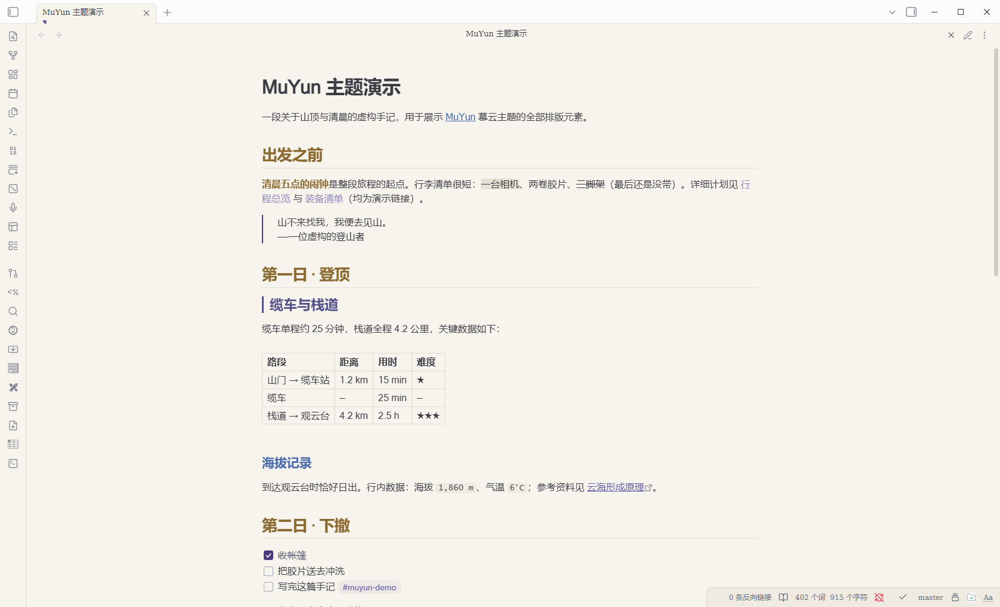
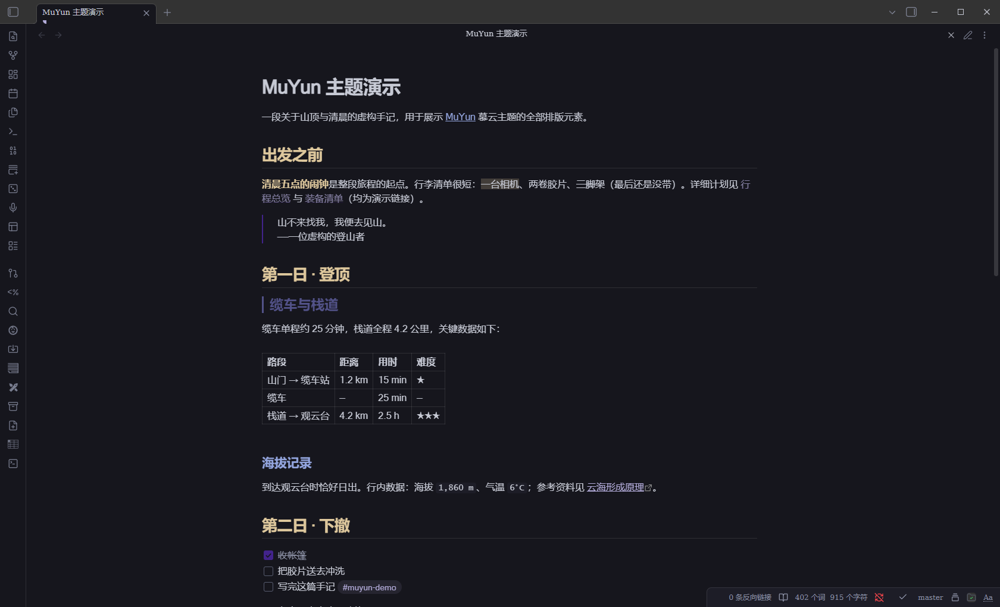

# MuYun 慕云

> A snug Obsidian theme for **long-form reading, fast writing & quick navigation** — with an optional companion plugin that adds JS-powered reading aids.
> 一款为**长文阅读、高效写作、快速定位**而生的 Obsidian 主题——可选配套插件提供纯主题做不到的阅读增强。

**[English](#overview)** · [中文](#概述-overview)

---

## Overview 概述

**EN** — MuYun (慕云, "admiring the clouds") is designed around three pillars. **Reading comfort**: paper-like surfaces in dark "ink night" and light "morning glow" variants, body text tuned into a ~10:1 contrast comfort band instead of maximum contrast, and every accent color desaturated 30–40% with its hue preserved, so long sessions don't fatigue your eyes. **Writing efficiency**: the editing and reading views share the same variable set, so switching modes never causes visual jumps; an optional companion plugin adds paragraph focus and typewriter scrolling for draft work. **Quick navigation**: three-tier heading colors, an H2 wayfinder stripe, a file-tree skeleton with parent-chain highlight, outline dots colored by heading level, search hit highlighting, and a restrained motion system — everything is built so that with hundreds of notes you can still find your place with a glance.

**中文** — MuYun（慕云）围绕三大支柱设计。**阅读舒适**：深色「墨蓝夜空」与浅色「晨光暖纸」两种纸感底色，正文对比度压在 ≈10:1 的舒适带而非最大值，所有强调色降饱和 30–40% 并保留色相，长时间阅读不累眼。**写作高效**：编辑态与阅读态共用同一套变量，模式切换零视觉跳变；可选配套插件为写稿提供段落聚焦与打字机滚动。**快速定位**：标题三级色阶、H2 路标条、文件树骨架与父链高亮、按标题层级着色的大纲圆点、搜索命中高亮、克制的动效系统——所有设计都为了让「几百篇笔记里一瞥定位」成立。

## Highlights ✨ 亮点

- **Eye-friendly color system · 护眼配色体系** — Dark "ink paper" & warm-paper light scheme; body contrast presets **soft / standard / firm** (~8.5 / ~10 / ~12.5:1); accents desaturated, hue preserved. 深色墨蓝纸 × 浅色晨光暖纸；正文对比度**柔和 / 标准 / 扎实**三档可调；强调色降饱和不偏色。
- **Three-tier heading colors · 标题三级色** — H1 amber / H2 mallow purple / H3 link blue, H4–H6 stay neutral; an H2 wayfinder stripe catches the eye during fast scrolling; inline title enlarged to 2.0em with extra spacing. H1 沙金 / H2 慕云紫（带 3px 路标条）/ H3 链接蓝，H4–H6 保持正文色；内联标题 2.0em 拉开文件与章节层级。
- **Navigation UI · 导航界面** — File tree: bold folder skeleton, active-file marker bar, **parent-chain highlight** (hovering a deep file lights up all its ancestors); outline panel with heading-colored level dots; active-tab indicator; quick-switcher selection bar; search hit highlighting; graph nodes in palette colors. 文件树：文件夹加粗、当前文件左条、悬停深层文件时**祖先文件夹逐级亮起**；大纲层级圆点（金/紫/蓝 = 标题色系）；标签页活动色条；快速切换器选中条；搜索命中高亮；图谱节点池色。
- **Callout palette system · Callout 语义色** — All semantic colors derive from one 11-color palette: note 蓝紫 / success 苔绿 / warning 陶土 / danger 暗红 / example 慕云紫 — calm, but always distinguishable at a glance. 全部语义色取自同一调色板，低饱和但一眼可辨。
- **Restrained motion · 克制动效** — Hover fades, expand slide-ins, checkbox pop-in; all ≤200ms, opacity/transform only, `prefers-reduced-motion` respected, and a one-switch **Efficiency mode** kills every animation. 悬停渐亮、展开淡入、勾选弹入；全部 ≤200ms、只动透明度与位移；**效率模式**一键全关，另有单项开关与提速档。
- **Print/PDF ready · 打印导出** — Exporting to PDF always yields a light paper document, even in dark mode. 暗色模式下导出 PDF 也自动转为白纸黑字。
- **Mobile & narrow screens · 移动端适配** — Line width adapts below 750px, inline title steps down, interface density tightens. 窄屏自动收紧行长与密度，视觉降噪。

## Screenshots 截图

**Light · 晨光暖纸**

**Dark · 墨蓝夜空**

## Install 安装

### Theme 主题

- **Community themes 社区目录**：Settings → Appearance → Themes → Browse → search **"MuYun"**（目录搜索同步有数小时延迟）。设置 → 外观 → 主题 → 浏览 → 搜索 MuYun。
- **Manual 手动安装**：Download `manifest.json` and `theme.css` from [Releases](https://github.com/GarrettFynn/obsidian-muyun/releases), put both into `<vault>/.obsidian/themes/MuYun/`, then select MuYun in Settings → Appearance. 从 [Releases](https://github.com/GarrettFynn/obsidian-muyun/releases) 下载 `manifest.json` 与 `theme.css`，放入库目录 `.obsidian/themes/MuYun/`，再在外观设置中选择 MuYun。

### Companion plugin 配套插件（可选 Optional）

The theme is pure CSS and works fully on its own. **MuYun Companion** adds what CSS cannot do — ten reading & writing aids, each with its own toggle. 主题本身纯 CSS、独立完整。**MuYun Companion** 补足 CSS 做不到的部分——十项阅读/写作增强，每项可独立开关。

**What it adds 功能清单**：

| Feature 功能 | Default 默认 | What it does 说明 |
| --- | --- | --- |
| Reading progress bar 阅读进度条 (H1) | On 开 | 4px gradient bar at the top, follows scrolling. 顶部 4px 渐变细条，随滚动显示读到哪了 |
| Edge minimap 侧缘小地图 (H8) | On 开 | Heading dot-rail on the right; tracks scrolling (reading) or cursor (live preview); click to jump; read trail persisted. 右缘标题点轨，阅读态随滚动、编辑态随光标，点击跳转，已读轨迹持久化 |
| Reading spotlight 阅读聚光灯 (H2) | Off 关 | Current section lit, others dimmed — scroll-driven in reading view, cursor-driven in live preview. 当前小节全亮其余降透明：阅读态跟滚动、实时预览跟光标 |
| Resume reading 续读记忆 | On 开 | Reopens each note at the position you left (LRU 400 notes). 每篇笔记记住上次读到的位置 |
| Heading breadcrumb 标题面包屑 | On 开 | Status bar shows `Chapter › Section` and updates as you scroll. 状态栏实时显示当前章节路径 |
| Reading time 阅读时长估计 | On 开 | "≈N min" in the status bar (400 CJK chars/min). 状态栏显示预计阅读分钟数 |
| Reading stats 阅读统计 | Off 关 | Local daily/per-note time tracking, daily goal, weekly report, 12-week heatmap. 本地记录每日/每篇阅读时长、每日目标、周报与 12 周热图 |
| Copy section link 复制小节链接 | — | Command that copies `[[Note#Section]]` to the clipboard. 一键复制当前小节的维基链接 |
| Paragraph focus 段落聚焦 | Off 关 | In live preview, the paragraph around the cursor stays lit, the rest fades (writing mode). 光标所在段落全亮、其余淡出（写稿模式） |
| Typewriter scrolling 打字机滚动 | Off 关 | Keeps the cursor at the upper third of the screen, smooth-eased. 光标始终保持在屏幕上三分之一处（平滑滚动） |

**How to install 安装步骤**：

1. Download the three files from the [**Companion release page**](https://github.com/GarrettFynn/obsidian-muyun/releases/tag/companion-0.5.0): `main.js`, `manifest.json`, `styles.css`. 从[配套插件发布页](https://github.com/GarrettFynn/obsidian-muyun/releases/tag/companion-0.5.0)下载这三个文件。
2. Put them into `<vault>/.obsidian/plugins/muyun-companion/` (create the folder if needed). 放入库目录 `.obsidian/plugins/muyun-companion/`（没有就新建该文件夹）。
3. In Obsidian: Settings → Community plugins → turn off **Restricted mode** if asked → enable **MuYun Companion** → press `Ctrl+R` once. 设置 → 第三方插件 → 关闭安全模式（如提示）→ 启用 MuYun Companion → 按 `Ctrl+R` 重载一次。
4. Optional: install [Style Settings](https://github.com/mgmeyers/obsidian-style-settings) for 12 companion options + 24 theme options. 可选：安装 Style Settings 插件解锁 12 项插件参数与 24 项主题参数。

> The plugin is pure local computation — no network access, no telemetry. It degrades gracefully: without it the theme loses nothing. 插件纯本地计算、零联网零遥测；不装它主题功能零损失。

## Style Settings 样式设置

With [Style Settings](https://github.com/mgmeyers/obsidian-style-settings) installed, **24 options** unlock: link / bold / heading colors (H1–H3), inline title size, paragraph spacing, body contrast presets, line-width presets (40/46/52rem), H2 stripe toggle, zebra table stripes, image cards, tab cards, heading auto-numbering (reading view), code line numbers (reading view), legacy dark accent, efficiency mode, motion speed, and per-effect motion switches. 安装 Style Settings 后可调 24 项：链接/加粗/标题色、内联标题字号、段距、对比度三档、行宽三档、H2 路标条、斑马纹、图片卡片、标签页卡片化、标题自动编号、代码行号（后两者仅阅读视图）、深色灰紫兜底、效率模式、动效提速与单项动效开关。

> The dark interactive accent follows your Obsidian global accent color by design; a "legacy MuYun purple" toggle is provided. 深色交互色默认跟随 Obsidian 全局主题色，面板提供「恢复 MuYun 灰紫」开关。

## Recommended presets 推荐配置档

| Preset 档位 | Combination 组合 | For 适合 |
| --- | --- | --- |
| Late-night reading 深夜护眼档 | Dark · Efficiency mode · spotlight off | Zero-motion long reading. 睡前长文阅读，零动效零干扰 |
| Draft sprint 写稿专注档 | Paragraph focus · typewriter scrolling · H2 stripe | First drafts. 初稿冲刺，眼不离光标 |
| Deep study 长文精读档 | Spotlight (dim 0.25) · minimap · resume · breadcrumb | Large documents. 大部头啃书，定位最大化 |

## FAQ 常见问题

- **Parent-chain highlight doesn't fire? 父链高亮没反应？** It relies on CSS `:has()` (Obsidian 1.4+ on recent Chromium). It degrades silently — update Obsidian and retry. 依赖 CSS `:has()`（新版内核可用），不支持时静默降级，升级 Obsidian 即可。
- **Spotlight doesn't move in live preview? 实时预览聚光灯不动？** It follows the **cursor**, not scrolling, in that mode; scroll-driven behavior lives in reading view. 实时预览下它跟随**光标**而非滚动；滚动跟随在阅读视图里。
- **Progress bar invisible? 进度条不显示？** Markdown views only, and only when content exceeds one screen. 仅 Markdown 视图且内容超过一屏时出现。
- **Dark PDF? 导出 PDF 是深色的吗？** Never — printing always renders light paper. 永远是白纸黑字，`@media print` 自动转换。
- **danger Callout color? danger 标注颜色？** Dark red `#7E3232` — the single palette-external exception, chosen deliberately. 暗红 #7E3232，全主题唯一调色板外例外色，经拍板选定。

## License

MIT © [GarrettFynn](https://github.com/GarrettFynn)（甘慕云）
